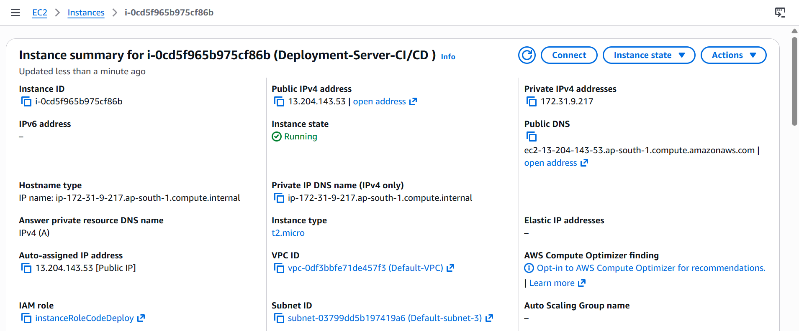
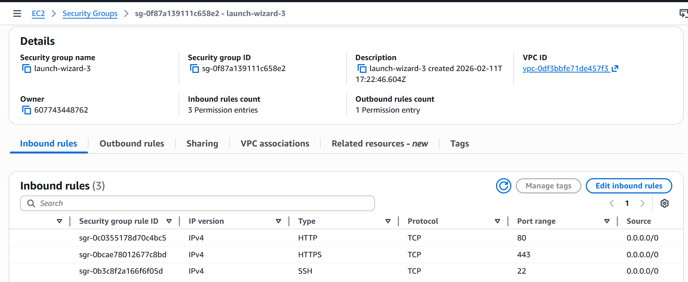
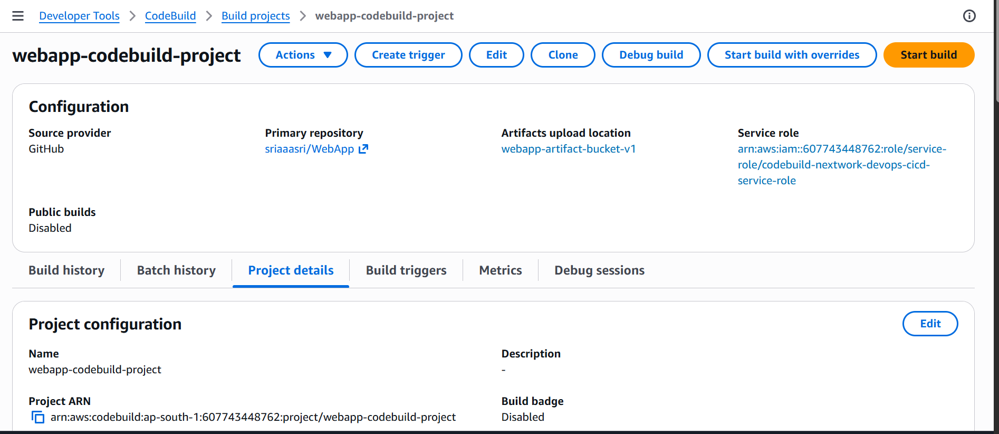
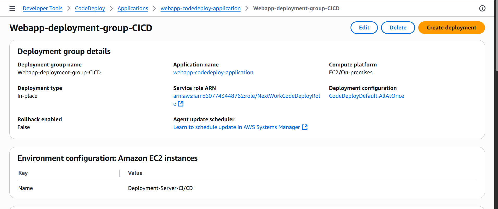
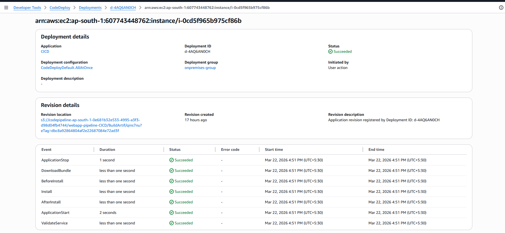
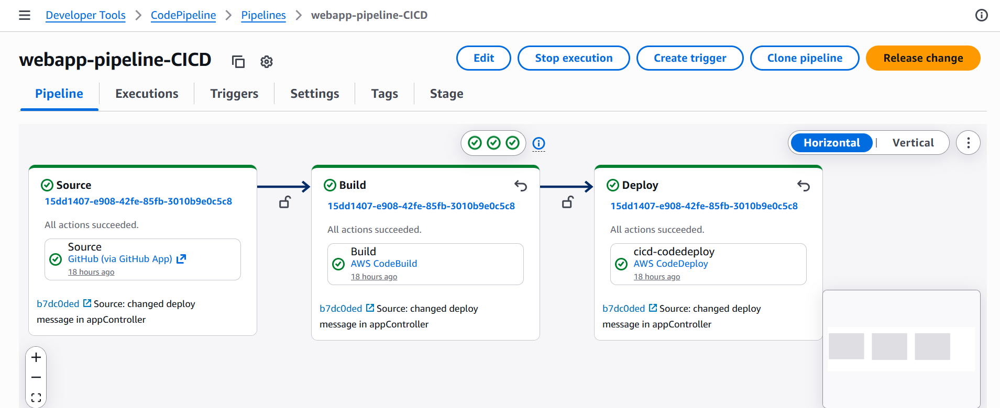

# AWS-CICD-Pipeline
A simple Devops CICD project.

**Author:** P. sri satya 

---

### **Table of Contents**
1. [Project Overview](#1-project-overview)
2. [Architecture Diagram](#2-architecture-diagram)
3. [Step 1: Spring boot application](#3-step-1-spring-boot-application)
4. [Step 2: AWS EC2 instance preparation](#4-step-2-aws-ec2-instance-preparation)
5. [Step 3: Install Dependencies on EC2](#5-step-3-install-dependencies-on-ec2)
6. [Step 4: AWS codebuild setup](#6-step-4-aws-codebuild-setup)
7. [Step 5: AWS codedeploy setup](#7-step-5-aws-codedeploy-setup)
8. [Step 6: AWS codepipeline setup](#8-step-6-aws-codepipeline-setup)
9. [Step 7: pushing changes and verification](#9-step-7-pushing-changes-and-verification)
10. [Conclusion](#10-conclusion)

---

### **1. Project Overview**
This project demonstrates how to build an end-to-end CI/CD pipeline using AWS services integrated with GitHub.
	It automates the process of building and deploying an application whenever code changes are pushed to the repository.
	The pipeline uses AWS CodePipeline for orchestration, CodeBuild for building the application, and CodeDeploy for deploying it to an EC2 instance.
	This setup eliminates manual deployment steps and ensures faster and more reliable releases.
	The project is designed as a beginner-friendly guide to understanding real-world DevOps workflows.

---

### **2. Architecture Diagram**

```
👨‍💻 Developer 
      │
      ▼
📦 GitHub Repository 
      │  (Push Code)
      ▼
🚀 AWS CodePipeline 
      │  (Orchestrates CI/CD)
      ▼
🔨 AWS CodeBuild ──▶ 📂 Amazon S3 ──▶ 🚚 AWS CodeDeploy ──▶ 🖥️ Amazon EC2 ──▶ 🌐 End Users
     (Build App)      (Store Artifact)    (Deploy App)        (Run App)         (Access App)
```
---

### **3. Step 1: Spring boot application**
In this step, we will create a simple Spring Boot application using Spring Initializr.

🔗 Generate project from: https://start.spring.io/

#### Project Configuration:
- Project: Maven
- Language: Java
- Spring Boot: 4.0.4
- Packaging: WAR
- Configuration: YAML
- Java Version: 17

#### Dependencies:
1) Spring Web

After generating the project, download and extract it to your local machine.

#### 🔧 Build the Application (WAR)
Navigate to the project directory and package the application:

```bash
mvn clean package
```
#### ▶️ Run the Application Locally

```bash
java -jar target/<your-app-name>.war
```
#### 🌐 Verify the Application
Open your browser and access:

```bash
http://localhost:8080
```
---

### **4. Step 2: AWS EC2 instance preparation**

1.  **Launch EC2 Instance:**
    * Navigate to the AWS EC2 console.
    * Launch a new instance using the **Amazon Linux** AMI.
    * Select the **t2.micro** instance type for free-tier eligibility.
    * Create and assign a new key pair for SSH access.



2.  **Configure Security Group:**
    * Create a security group with the following inbound rules:
        * **Type:** SSH, **Protocol:** TCP, **Port:** 22, **Source:** Anywhere (0.0.0.0/0)
        * **Type:** HTTP, **Protocol:** TCP, **Port:** 80, **Source:** Anywhere (0.0.0.0/0)
        * **Type:** HTTPS, **Protocol:** TCP, **Port:** 443, **Source:** Anywhere (0.0.0.0/0)



3.  **Connect to EC2 Instance:**
    * Use SSH to connect to the instance's public IP address.
    ```bash
    ssh -i /path/to/key.pem ec2-user@<ec2-public-ip>
    ```
---

### **5. Step 3: Install Dependencies on EC2**

In this step, we install the required dependencies on the EC2 instance to run the Spring Boot application and enable deployments using AWS CodeDeploy.

#### ☕ JDK 17

- Required to run the Spring Boot application
- Install Java 17 (Amazon Corretto)

```bash
sudo dnf install java-17-amazon-corretto -y
java -version
```
configure JAVA 

```bash
echo "export JAVA_HOME=/usr/lib/jvm/java-17-amazon-corretto" >> ~/.bashrc
echo "export PATH=\$PATH:\$JAVA_HOME/bin" >> ~/.bashrc
source ~/.bashrc
```

#### 🌐 Nginx

2)  **Installing and configuring**
    * Used as a reverse proxy to handle incoming traffic
    * Routes requests from port 80 to the application server (Tomcat).

```bash
sudo dnf install nginx -y
sudo systemctl start nginx
sudo systemctl enable nginx
sudo systemctl status nginx
```
3) **Tomcat 11**
    * Used to deploy and run the Spring Boot WAR file.

```bash
cd /home/ec2-user
wget https://downloads.apache.org/tomcat/tomcat-11/latest/bin/apache-tomcat-11.tar.gz
tar -xvzf apache-tomcat-11.tar.gz
mv apache-tomcat-11* tomcat
```

4) **CodeDeploy Agent**
    * Required for AWS CodeDeploy to access and deploy to the EC2 instance.

```bash
sudo dnf install ruby -y
sudo dnf install wget -y

cd /home/ec2-user
wget https://aws-codedeploy-ap-south-1.s3.ap-south-1.amazonaws.com/latest/install
chmod +x ./install
sudo ./install auto
```
#### Start and enable CodeDeploy Agent

```bash
sudo systemctl start codedeploy-agent
sudo systemctl enable codedeploy-agent
sudo systemctl status codedeploy-agent
```

---

### **6. Step 4: AWS codebuild setup**

--steps to create build project
Project name: "name"
Project type: Default project
Source provider: GitHub
**Connect your github account**
Repository: Repository in my GitHub account

**Environment**
* Provisioning model : On-demand
* Environment image: Managed image
* Compute: EC2
* Running mode: Instance
* Operating system: Amazon Linux
* Runtime: Base
* Service role: New service role
* Role name: "Give a new service role name"

**Additional configuration**
* compute : 2vCPUs, 4 GIB (just to avoid extra charges)

**BuildSpec**
* Build specifications: Use a buildspec file
* name: buildspec.yml  (make sure create a buildspec.yml file in root directory of you project)

**Artifacts**
* Type: Amazon S3
* Bucketname: "give a existing bucket name to save final artifacts"
* name: "name you prefered of zip file"
* Artifacts packaging: Zip

**Logs**
* Group name: /aws/codebuild/"project-name"



---

### **7. Step 5: AWS codedeploy setup**

AWS CodeDeploy is a deployment service that automates the process of deploying applications to compute resources such as Amazon EC2 instances. It enables seamless and consistent deployments by managing the entire deployment lifecycle, including copying application files and executing deployment scripts. CodeDeploy works with an agent installed on the EC2 instance, which allows it to interact with the server and perform deployment actions. This helps reduce manual effort, minimize downtime, and ensure reliable application updates.

**Application setup in codedeploy**
* Application name: "Applicaiton name"
* Compute platform: EC2/On-premises

**Deployment group setup in codedeploy**
* Deployment group name: "Deployment group name"

we need a service role for codedeploy to access EC2 instances
**service role creation**
* Trusted entity type: AWS service
* service: CodeDeploy
* Use case: CodeDeploy
* Role name: "prefered name for role"

#### Refresh Deployment groups page
* Service role : "Above created role"
* Deployment type : In place
* Environment Configuration: Amazon EC2 instances
* Tag group1 : key=Name , value="EC2 instance name created in previous step for deployment in Step-2."
* Deployment configuration: CodeDeployDefault.AllAtOnce  



**Deployment setup in codedeploy**

* Deployment group: "Deployment group created before"
* Revison type: My application is stored in Amazon S3
* Revision location: "Navigate to S3 bucket created by codebuild , select output artifact and copy S3 URI"
* --create deployment and wait for 1-2 minutes deployment will be created--


**⚠️ Important:** A deployment will trigger after after deployment creation.
#### Pre-requests:
* "appspec.yml" configuration file should be present in S3 output root location
* S3 bucket should contain output zip file created by codebuild

#### Access you application in deployment server 

* Make sure nginx in configured to route traffic to tomcat server 80->8080
* Append application war file name before the endpoints
like if your war file created like webapp.war then append webapp

```bash
http://<EC2-public-IP>/<warfile-name>/<endpoints>
```



---

### **8. Step 6: AWS codepipeline setup**

#### CodePipeline:
With CodePipeline, you can create a workflow that automatically moves your code changes through the build and deployment stage. In our case, you'll see how a new push to your GitHub repository automtically triggers a build in CodeBuild (continuous integration), and a then a deployment in CodeDeploy (continuous deployment)!

### Configuration details
* Category: Build custom pipeline
* Pipeline name: "prefered pipeline name"
* Execution mode: Superseded
* Service role: "prefered service role name"

--------------------------------------------------
* Source provider: GitHub (via GitHub App).
* Connection: "create new connection or use existing one"
* Repository name: "username/Repository name"
* Default Branch: "Branch name"
* Webhook: Enable
----------------------------------------------------
* Build provider: Other Build providers
* Project name: "Enter codebuild project name created before"
* Build type: single build
------------------------------------------------------
* Deploy provider: AWS CodeDeploy
* Application name: "Select codedeploy application created before"
* Deployment groups: "Deployment group under selected application"

### Review and create pipeline



---

### **9. Step 7: pushing changes and verification**

Now for the final test. After creating pipeline runs automatically and process starts in 3 stages

push the chages to github 
trigger the pipeline by clicking "Release change"
we can moitor the process by selecting each stage

---

### **10. Conclusion**

In this project, we successfully built an end-to-end CI/CD pipeline using AWS services integrated with GitHub. The pipeline automates the process of building, packaging, and deploying a Spring Boot application to an EC2 instance using CodeBuild and CodeDeploy. This setup eliminates manual deployment steps and ensures faster, consistent, and reliable application delivery.

Through this implementation, we gained hands-on experience with real-world DevOps practices such as pipeline orchestration, automated deployments, and infrastructure configuration. This project serves as a foundational example for building scalable and production-ready CI/CD workflows on AWS.

---